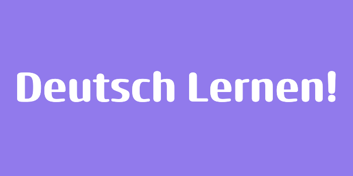
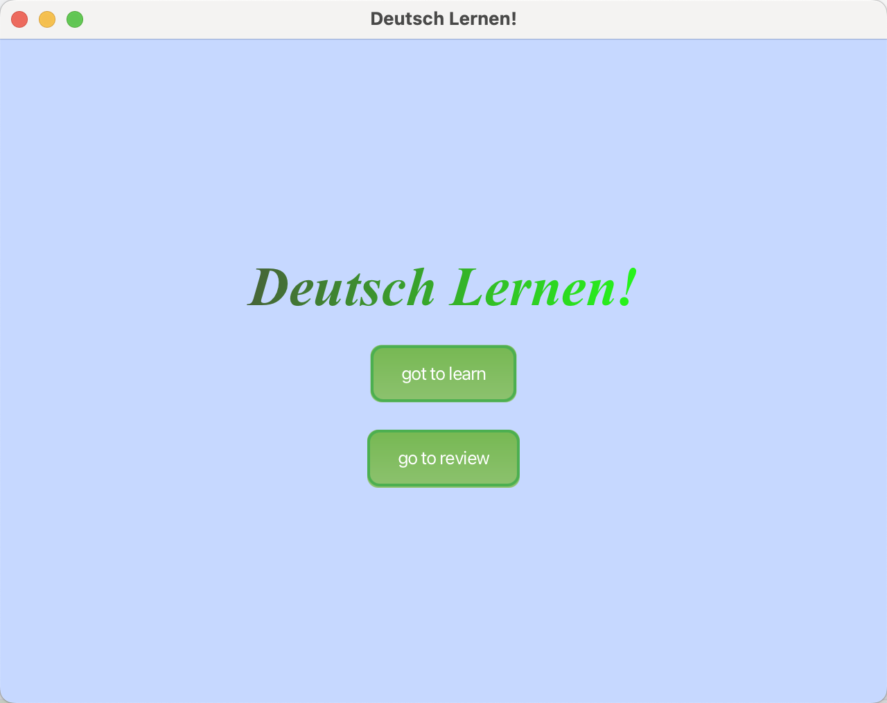
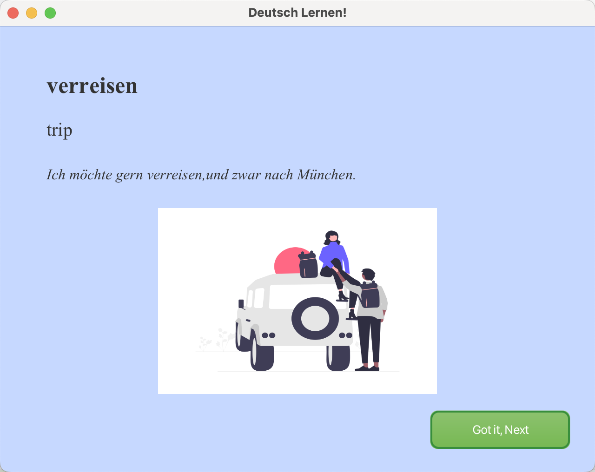
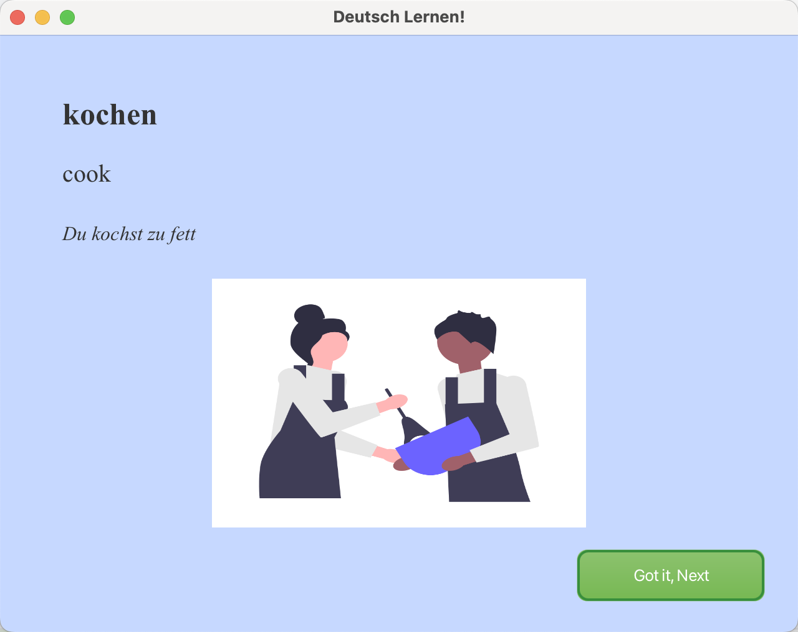
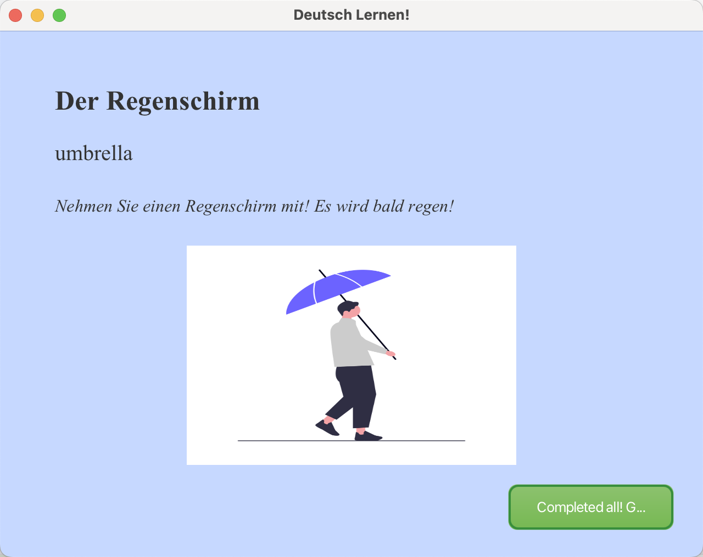
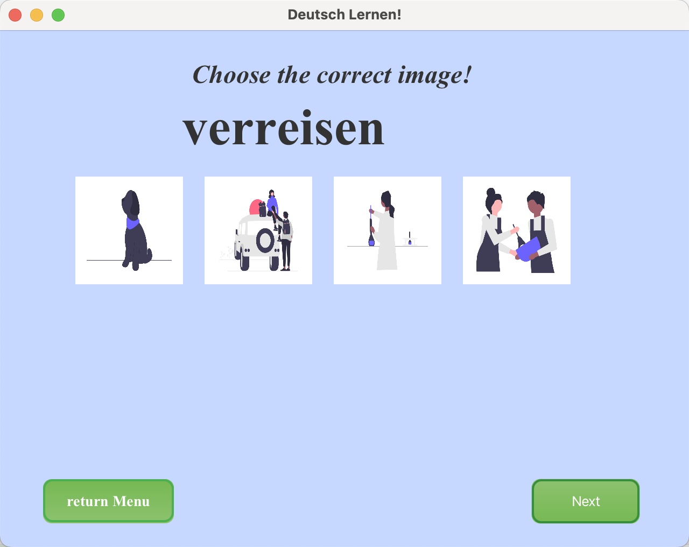
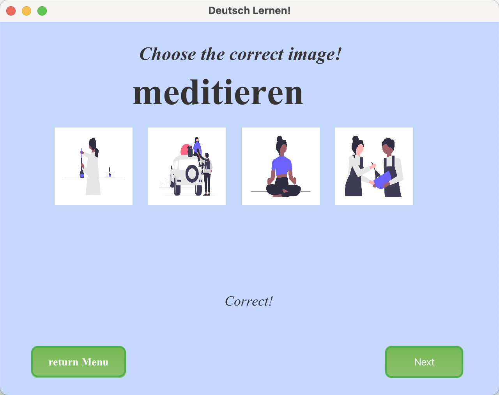
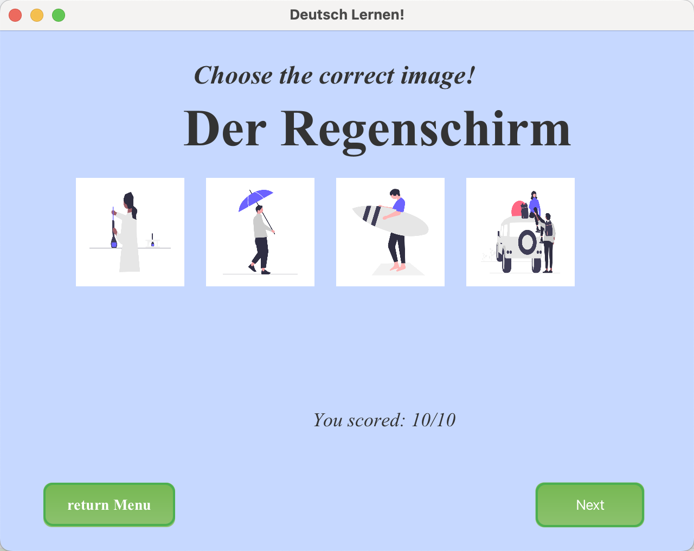

# German Vocabulary Learning App


## Overview
This JavaFX-based application helps users learn and review German vocabulary interactively. The app provides a simple yet engaging interface with three main functionalities:

1. **Welcome Page**: Introduces the app and offers navigation options to either learn new words or review previously learned words.
2. **Learning Mode**: Displays German words along with their English translations, example sentences, and related images to facilitate understanding and retention.
3. **Review Mode**: Tests the user's knowledge with picture-based multiple-choice questions. A progress summary is provided at the end of the review session.

---

## Features
- **User-Friendly UI**: Intuitive design for seamless navigation between learning and review sessions.
- **Visual Learning**: Each German word is accompanied by an image to enhance memory retention.
- **Interactive Quizzes**: Picture-based multiple-choice questions for reviewing vocabulary.
- **Progress Feedback**: Displays the user's success rate after completing the review session.

---


### Prerequisites
1. **Java Development Kit (JDK)**: Version 11 or higher.
2. **JavaFX SDK**: Download the JavaFX SDK compatible with your JDK version.
3. **IDE**: IntelliJ IDEA (recommended) or any Java-compatible IDE with JavaFX support.

### Steps
1. Clone or download the project:
   ```bash
   git clone <repository_url>
   ```
2. Open the project in your IDE.
3. Configure the JavaFX SDK:
    - Set the path to the JavaFX SDK in your project settings.
    - Add VM options for running the application:
      ```
      --module-path /path/to/javafx-sdk/lib --add-modules javafx.controls,javafx.fxml
      ```
4. Build and run the project.

---

## Usage

### 1. Welcome Screen
- Two buttons are available:
    - **go to learn**: Navigates to the learning mode.
    - **go to review**: Navigates to the review mode.

### 2. Learning Mode
- Displays a German word, its English translation, an example sentence, and a related image.
- Click the **Got it, Next** button to proceed to the next word.
- After completing all words, click **Completed All! Go to Review** to proceed to the review mode.

### 3. Review Mode
- Presents multiple-choice questions with images as answer options.
- Click on the image that corresponds to the displayed German word.
- If correct, the app automatically proceeds to the next question.
- If incorrect, the correct answer is highlighted, and you can click **Got it** to continue.
- At the end, your success rate is displayed, along with a button to return to the Welcome Screen.

---

## File Structure

```
├── src
│   └── main
│       ├── java
│       │   └── org
│       │       └── example
│       │           └── demo2
│       │               ├── HelloApplication.java   #Entry point for the application   
│       │               ├── HelloController.java    #Controller for the menu-screen
│       │               ├── learnController.java    #Controller for the learn-word-screen
│       │               └── reviewController.java   #Controller for the review-word-screen
│       └── resources
│           ├── images
│           │   ├── hund.png       #Picture for the german words
│           │   ├── katze.png
│           │   ├── kochen.png
│           │   ├── küssen.png
│           │   ├── meditieren.png
│           │   ├── regenschirm.png
│           │   ├── spazieren.png
│           │   ├── surfen.png
│           │   ├── verreisen.png
│           │   └── wissenschaftlerin.png
│           └── org
│               └── example
│                   └── demo2
│                       ├── hello-view.css      #CSS file for the menu-screen
│                       ├── hello-view.fxml     #Lay out of the menu-screen
│                       ├── learn.css           #CSS file for the learn-word-screen
│                       ├── learn.fxml          #Lay-out of the learn-word-screen
│                       ├── review.css          #CSS file for the review-word-screen
│                       └── review.fxml         #Lay out of the review-word-screen
└── target
```

---
## Screen shots








## Future Improvements
- Add a database or file storage to save user progress and expand vocabulary.
- Introduce additional question types, like sentence fill-in-the-blanks.
- Provide pronunciation audio for each word.
- Implement user accounts for personalized learning.

---

## License
This project is open-source and available under the MIT License.

Enjoy learning German words interactively! 😊

